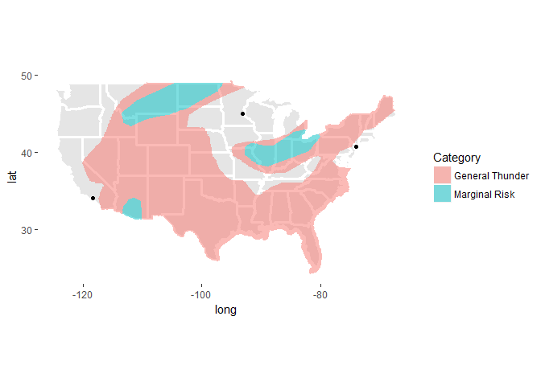

<!-- README.md is generated from README.Rmd. Please edit that file -->
spcmap
======

An R package to map coordinates with NOAA Storm Prediction Center severe weather risks

Introduction
------------

This is a small package that contains a few functions to plot coordinates of interest against the [NOAA Storm Prediction Center](http://www.spc.noaa.gov/) (SPC) outlooks

Installation
------------

The package can be installed via the `devtools` package:

    devtools::install_github("neyhartj/spcmap")

Examples
--------

The package contains one primary function, `spcmap` and a few secondary supporting functions.

Say you have a set of coordinates that you want to map:

``` r
dat <- data.frame(
  city = c("MSP", "JFK", "LAX"),
  long = c(-93.17567, -74.0071, -118.2453),
  lat = c(44.98231, 40.7146, 34.0535)
)
```

Use the `spcmap` function to download the SPC data for a particular day and type. You can download data for the current day or up to two days in the future. Outlook types include categorical, tornado, hail, and wind. The following table outlines the codes:

|  Type  |   Outlook   |
|:------:|:-----------:|
|  `cat` | categorical |
| `torn` |   tornado   |
| `hail` |     hail    |
| `wind` |     wind    |

For example, let's find the categorical data for day 1

``` r
spc <- spcmap(data = dat, day = 1, type = "cat")
```

You can use the `summary()`, `print()`, and `plot()` functions to explain or plot the results.

``` r
# Summary
summary(spc)
## Phew! No severe wether is anticipated for the coordinates.
```

``` r
# Plot
plot(spc)
```



Author
------

Jeff Neyhart
